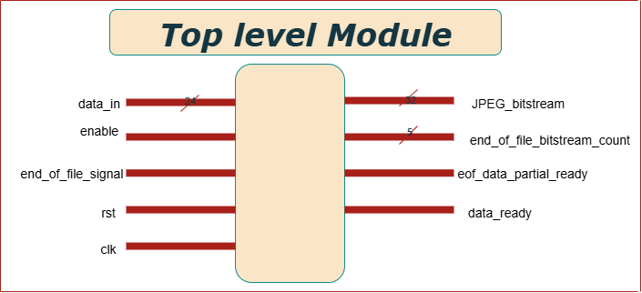
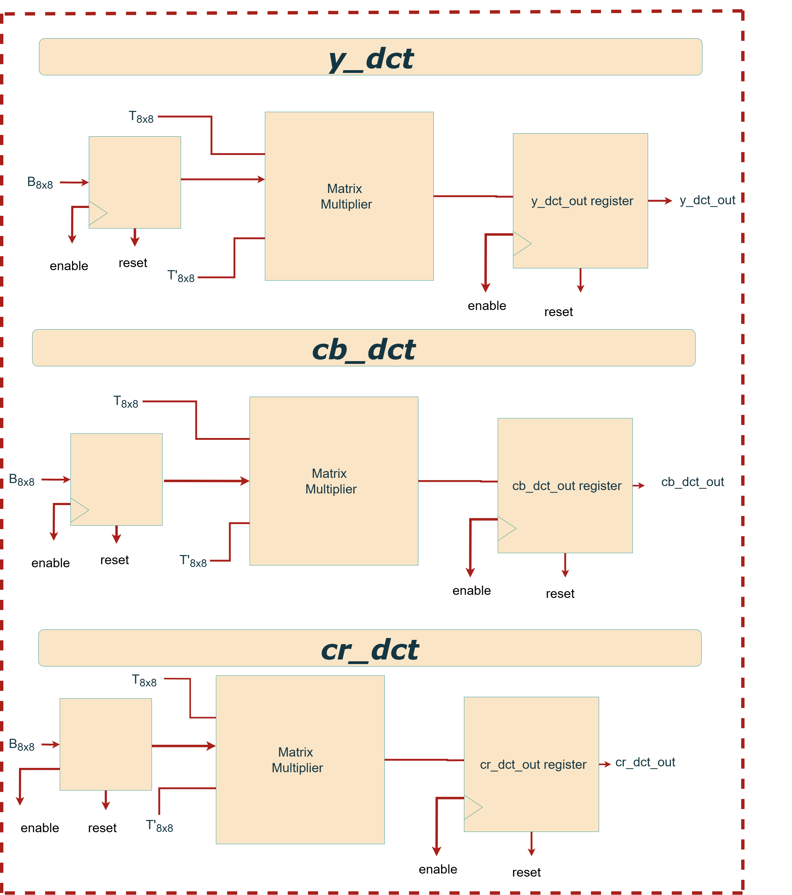
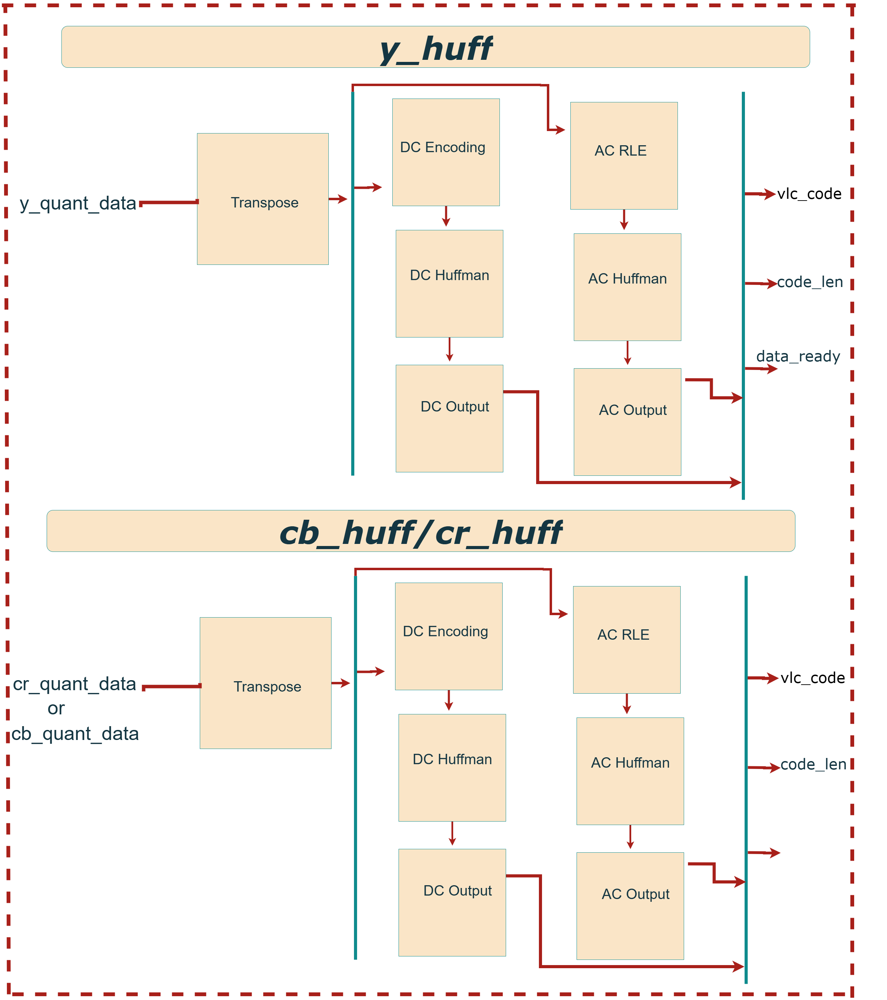
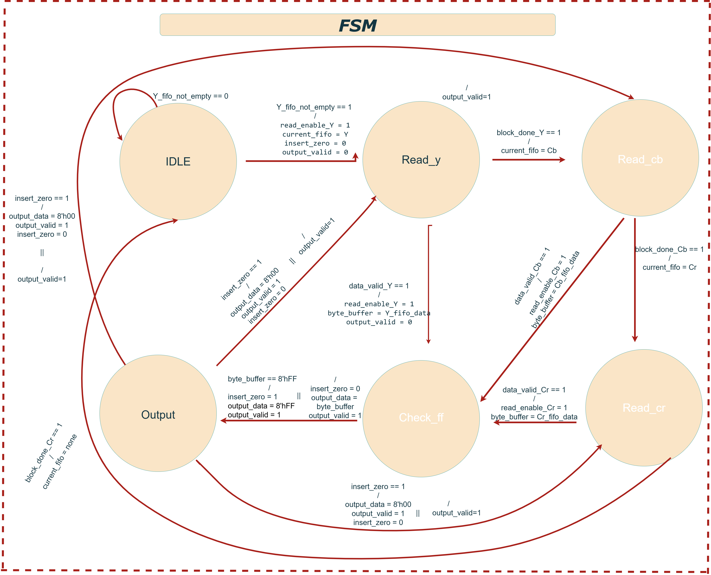

# JPEG-Based Lossy Image Compression System

> **Hardware JPEG Encoder (SystemVerilog Implementation)**
>
> 🗕️ *Last updated: July 30, 2025*
> © 2025 [Maktab-e-Digital Systems Lahore](https://github.com/meds-uet). Licensed under the Apache 2.0 License.

---

## Overview

This project implements a **hardware JPEG encoder** using **SystemVerilog**. It compresses RGB image data following the standard JPEG pipeline:

                               Color Conversion → DCT → Quantization → Huffman Coding → Bitstream Assembly 
---

###  Why JPEG?

* Reduces file size by discarding perceptually insignificant data
* Enables fast transmission and efficient memory use
* Maintains high visual fidelity
* Universally supported across hardware/software platforms

---
## System Architecture
### Top-Level Block Diagram

 

#### Inputs:
* `data_in [23:0]`: RGB input pixel `{R, G, B}`
* `enable`: Starts processing the current pixel
* `end_of_file_signal`: Flags final pixel
* `rst`: Active-high reset
* `clk`: Clock signal
  
### Detail:
The jpeg_top module is the main entry point for the JPEG encoder core and interfaces with minimal external signals. It operates using a single global clock, with all registers synchronized to its rising edge. The main control signals are enable, reset, and end_of_file_signal. The enable signal should be asserted high when pixel data is available and must remain high while feeding 64 pixels (one 8×8 block) over 64 consecutive clock cycles. After each block, enable must stay high for at least 33 additional clock cycles (during which no new data is provided), followed by one clock cycle of enable being low before loading the next block. This pattern repeats for all blocks in the image. Pixel data is provided via a 24-bit input bus, where blue is in bits [23:16], green in [15:8], and red in [7:0]. The end_of_file_signal is asserted high at the first cycle of the last 8×8 block to notify the core that the current data is the final block and that all remaining bits must be output.

#### Outputs:

* `JPEG_bitstream [31:0]`: Final compressed JPEG data
* `end_of_file_bitstream_count [3:0]`: Remaining byte count
* `eof_data_partial_ready`: Final block ready signal
* `data_ready`: Valid compressed output signal
### Detail:
The output of the encoder is a 32-bit JPEG bitstream provided on the JPEG_bitstream signal. The most significant byte is in bits [31:24], followed by [23:16], [15:8], and [7:0]. This output is valid only when the data_ready signal is high, which is asserted for one clock cycle per valid output word. For the final block, if the remaining bits do not fill an entire 32-bit word, the signal eof_data_partial_ready will go high for one cycle, and the number of valid bits in JPEG_bitstream is indicated by the 5-bit end_of_file_bitstream_count. This ensures that no compressed data is lost at the end of the encoding process.

---

## Pipeline Architecture

 

The JPEG encoding pipeline begins its process with the `rgb2ycbcr` module, which takes incoming RGB pixel data and, once an 8x8 block is processed, outputs separate Y, Cb, and Cr data blocks along with a `data_ready` signal; these outputs simultaneously fan out as inputs to the three parallel `y_dct`, `cb_dct`, and `cr_dct` modules. Each DCT module then transforms its respective block into 12-bit signed frequency domain coefficients (`*_dct_data`), passing these, along with `dct_valid` and `block_valid` signals, to their corresponding `y_quantizer`, `cb_quantizer`, and `cr_quantizer` modules. From the quantization stage, the 8-bit `*_quantized_data` and control signals (`quant_valid`, `block_done`) are routed to the respective `y_huff`, `cb_huff`, and `cr_huff` Huffman encoding modules. In a parallel path from the quantization stage, the 12-bit quantized data also feeds into intermediate buffers (`yd_q_h`, `cbd_q_h`, `crd_q_h`), which then combine to form a 24-bit `data_in` for the `pre_fifo` stage, subsequently feeding into the `fifo_out` module. Both the Huffman encoders (providing `vc_code` and `code_len`) and the `pre_fifo` (providing `data_in`) connect to this `fifo_out` module, which then packs the incoming data into a continuous 32-bit `JPEG_bitstream`, also outputting `data_ready` and `orc_reg` (output register count). This 32-bit `JPEG_bitstream` then directly connects to a `sync_fifo_32` for synchronized data flow, whose output (`syncd_data` and `data_ready`) then feeds into the `ff_checker` module for bitstream integrity checks. Finally, the `ff_checker`'s validated output (`checked_data` and `checked_valid`) connects to the `jpeg_out` module, which serves as the ultimate output interface, providing the final `output_data` along with `output_valid` and `write_enable` signals to the external environment.

---
## Modules Descriptions
### `RGB2YCBCR`

The `rgb2ycbcr module` is the first processing block in the JPEG encoder pipeline, responsible for converting incoming 24-bit RGB pixel data {B[7:0], G[7:0], R[7:0]} into the YCbCr color space {Cr, Cb, Y} using the ITU-R BT.601 standard. This transformation separates luminance (Y) from chrominance (Cb and Cr) using weighted sums of the red, green, and blue components:

                                                    Y  =  0.299 × R + 0.587 × G + 0.114 × B  
                                                    Cb = -0.1687 × R - 0.3313 × G + 0.5 × B + 128  
                                                    Cr =  0.5 × R - 0.4187 × G - 0.0813 × B + 128 
                                                    
To implement this efficiently in hardware, all coefficients are scaled by 2¹³ (8192) and applied using fixed-point arithmetic. The conversion is pipelined in two stages: the first computes fixed-point products and partial sums, while the second performs rounding (based on the 13th discarded bit), adds chrominance offsets, right-shifts to restore 8-bit values, clips the results to the 0–255 range, and registers the outputs. The output YCbCr data becomes valid after two clock cycles, and a pipelined enable_out signal ensures accurate timing.

---

### `*_dct`: DCT Modules

The `y_dct, cb_dct, and cr_dct modules` each perform a 2D Discrete Cosine Transform (DCT) on 8×8 blocks of image data corresponding to the Y (luminance), Cb (chroma blue), and Cr (chroma red) components in a JPEG encoder. This transformation shifts pixel data from the spatial domain to the frequency domain, enabling efficient compression. The computation follows the formula 

                                                    DCT_Output = T × Block × inv(T)

where T is the scaled DCT matrix (scaled by 2¹⁴ = 16384 for fixed-point precision). The transformation is performed in three pipelined stages: row-wise matrix multiplication, column-wise transformation using the transpose of T, and final accumulation and rounding. To simplify hardware, these modules avoid subtracting 128 from each pixel (required for zero-centering in standard DCT). Instead, the orthonormality of DCT matrix rows 2–8 ensures the +128 offset cancels out naturally. Only the first row introduces bias, which is corrected by subtracting a constant value (5932032) from the corresponding output coefficients. 

---

### `*_quantizer`: Quantization Modules

 

The `y_quantizer,cr_quantizer,cb_quantizer module` performs lossy compression by quantizing an 8×8 block of Y (luminance) DCT coefficients. Instead of dividing each coefficient by a quantization constant (which is computationally expensive in hardware), the module multiplies it with a precomputed reciprocal value scaled by 2¹² (4096). These reciprocal values (e.g., QQ1_1 = 4096 / Q1_1) are stored in a matrix and computed at compile time. The module operates in a 3-stage pipeline: first, sign-extending the 11-bit DCT input to 32 bits; second, multiplying with the scaled reciprocal; and third, performing a right-shift and rounding based on bit 11 of the result to finalize the quantized value. This rounding effectively removes the 2¹² scaling factor and ensures accurate fixed-point results. The final quantized output is a signed 11-bit value. 

---

### `*_huff`: Huffman Encoding

  

The `y_huff, cb_huff, and cr_huff modules` perform JPEG-compliant Huffman encoding for the Y (luminance), Cb (chroma-blue), and Cr (chroma-red) channels, respectively. Each module operates in five stages: (1) extracting sign and magnitude of the quantized DCT coefficients, (2) applying run-length encoding (RLE) to compress sequences of zero-valued AC coefficients, (3) performing lookups in predefined JPEG Huffman tables, (4) packing the variable-length Huffman codes and amplitudes into 32-bit words, and (5) outputting the encoded data stream. For each 8×8 block, the DC coefficient is encoded first as a difference from the previous block’s DC value, followed by the AC coefficients traversed in zigzag order. Before Huffman encoding, the 8×8 quantized matrix is transposed to preserve left-to-right scan order across image blocks, compensating for the row–column operations used during DCT. Although the Huffman tables are customizable at compile-time, they are fixed during runtime. All possible Huffman codes should be included, even for small images, to avoid invalid encoding scenarios. These modules enable effective entropy coding, significantly reducing the size of the compressed JPEG output.

The `y_d_q_h, cb_d_q_h, and cr_d_q_h modules` each combine the DCT, quantizer, and Huffman encoder into a single compact processing unit for the Y, Cb, and Cr components respectively.

---

### `FIFO and FSM Handling`:

### Block Diagram

  

The `pre_fifo module` serves as an organizational wrapper that connects the outputs from the `y_huff, cb_huff, and cr_huff modules`, along with the `rgb2ycbcr module`. This module itself does not introduce any additional logic—it simply groups these modules into a single unit.

The next stage in the hierarchy is the `fifo_out module`. It incorporates the `pre_fifo output` and connects it to three instances of the `sync_fifo_32 module`. Each sync_fifo_32 serves as a temporary buffer for the Huffman-encoded data from the Y, Cb, and Cr channels. These FIFOs are 32 bits wide and 16 entries deep.

Although this configuration is generally sufficient, a smaller quantization table (which results in longer Huffman codes) can lead to buffer overflow, particularly for the Cb or Cr FIFOs. If more than 512 bits (32 bits × 16 entries) are generated for any one chrominance block, the corresponding FIFO will overflow. In practice, overflows were not observed during image encoding tests. The Y channel FIFO is read from more frequently and is therefore less prone to overflow.

The output JPEG bitstream is constructed in the following order: Huffman codes for the Y block first, followed by the Cb, and finally the Cr block for each 8×8 macroblock. This sequence is repeated for each subsequent block in the image.After fifo_out, the bitstream is passed to the `ff_checker module`. This module scans the byte-aligned bitstream for any occurrences of the 0xFF byte. According to the JPEG specification, if an FF is encountered, a 00 byte must be inserted immediately after it to prevent misinterpretation as a marker. The `ff_checker` implements this byte-stuffing using an internal sync_fifo for temporary storage.
Finally, the jpeg_out top-level module encapsulates both the fifo_out and ff_checker modules. 

---

## FSM State Table

This state machine governs the final output of the JPEG encoder by coordinating the reading and byte-stuffing of data from the Y, Cb, and Cr FIFOs. Initially, in the IDLE state, it waits until the Y FIFO has at least one byte available. Once ready, it transitions to the READ_Y state to fetch a byte of luminance (Y) data. After reading, the system enters the CHECK_FF state, where it checks if the byte is 0xFF. If so, it sets a flag (insert_zero = 1) to trigger byte-stuffing, a necessary step in JPEG encoding to avoid confusion with marker codes. In the OUTPUT state, the byte is sent to the output stream, and if the flag is set, a 0x00 byte is inserted right after. After processing the Y data, the state machine moves to READ_CB to handle the blue chrominance (Cb) byte and then to READ_CR for the red chrominance (Cr) byte, applying the same read, check, and output logic. This sequence ensures that the final JPEG bitstream is correctly serialized and compliant with the JPEG standard.

---
## Testbenches

##  1. `tb_rgb2ycrcb`

### 1. Purpose of Test Cases
The testbench is designed to check the accuracy of color space conversion under common edge cases and validate robustness with random RGB inputs. It ensures proper pipeline behavior, rounding, and output timing of the rgb2ycrcb module.

### 2. Input Vectors
The testbench applies both fixed and random RGB values:
Fixed RGB Values:
- (0, 0, 0) — Black
- (255, 255, 255) — White
- (255, 0, 0) — Red
- (0, 255, 0) — Green
- (0, 0, 255) — Blue
- (128, 128, 128) — Mid-gray
- Random RGB Values:
Ten 24-bit RGB values are generated using $urandom_range(0, 255) to simulate general use cases and uncover hidden bugs.

 ### 3. Expected Output:
Each input is applied with a 1-cycle enable signal and a 3-cycle wait to accommodate pipeline latency. The testbench checks for a valid enable_out and prints the YCbCr result in a readable format. 

 

 
 

---

## 2. `*_dct:`
### 1. Purpose of Test Cases
This testbench verifies the *_dct module, which performs an 8×8 Discrete Cosine Transform (DCT) on image blocks as part of JPEG encoding. It serially feeds 8-bit input pixels and observes 64 signed 11-bit DCT output coefficients. The test also tracks output_enable to confirm pipeline latency and output readiness.

### 2. Input Vectors
- All 128 (8'h80): Simulates a flat mid-gray block. Expected strong DC term ≈ 4096.
- All 64 (8'h40): Darker uniform block. Expected DC ≈ 2048.
- All 0 (8'h00): Fully black block. Expected DC = 0.
- All 255 (8'hFF): Bright white block. Expected DC ≈ 1020 due to internal level shifting.
- Checkerboard (alternating 0 and 255): High-frequency alternating pattern. Expected strong AC terms, DC = 0.
- Random Values ($urandom_range(0, 255)): Simulates real-world noisy image data. Expected DC varies, used to verify functional stability.
- Each pattern is fed serially (64 clock cycles) under active enable, simulating one 8×8 block.
- 
 ### 3. Expected Output:
Once processing is complete, output_enable goes high.
The testbench prints:
- The full 8×8 DCT coefficient matrix using $write formatting.
- A status line summarizing timing and DC verification,
  
 ### ***cr_dct***:
  

  

 ### ***cb_dct***:

 

---

## 3. `tb_*_quantizer`
### 1. Purpose
The test cases are designed to confirm that the quantization logic correctly applies scaling and rounding to signed DCT coefficients. The expected outputs are computed using the same reciprocal-based method used in hardware: multiplying by (4096 / Q[i][j]), right-shifting by 12, and rounding toward zero. The goal is to validate accuracy, rounding behavior, and pipeline timing across various coefficient patterns.

### 2.  Input Pattern
The testbench uses four structured input patterns to thoroughly test the quantizer:
- All 1023: Applies the maximum positive value (11'sd1023) to all matrix elements.
- Ramp Pattern: Gradually increasing values from 0 to 63 across the matrix.
- Checkerboard Pattern: Alternating +1023 and -1024 values to test signed rounding.
- Random Values: 64 random signed 11-bit inputs in the range [-1024, +1023] for general-case validation.
- These patterns are stored in the test_input matrix and applied to the Z input of the DUT.
  
### 3. Expected Outputs
After applying inputs and enabling the module for one clock cycle, the testbench waits for the out_enable signal to assert (indicating pipeline completion). It then prints the input matrix, expected quantized values, and actual hardware outputs side-by-side for visual comparison

 ### *** *_quantizer:***
  
  

  
  

  
  

  
  

  
---

## `tb_*_huff`:
### 1. Purpose
This testbench validates the functionality of the *_huff module, which performs Huffman encoding on an 8×8 block of quantized DCT coefficients for the components in JPEG compression. It ensures correct encoding of sparse DCT blocks, including proper handling of DC and AC coefficients, output bitstream generation, and end-of-block signaling.

### 2.  Input Pattern
Two test cases are included:
Test Case 1 – Sparse DCT Block
- Y11 = 50 (DC coefficient)
- Y21 = 3, Y13 = 2 (non-zero AC coefficients)
- All other coefficients are zero.
Test Case 2 – New DC & AC Coefficients After Reset
-Y11 = 100 (new DC)
-Y21 = 5 (non-zero AC)
-All others remain zero.
Each test applies a reset, then enables the module for one cycle to start encoding. The simulation runs long enough to process all 64 inputs through the internal pipeline.
  
### 3. Expected Outputs
For each test case, the monitor displays:The evolving state of data_ready, output_reg_count, end_of_block_output, and JPEG_bitstream.The encoded output should reflect the DC value followed by Huffman-encoded non-zero AC coefficients, terminated with an end-of-block symbol.

 ### ***y_huff***:
  
  

 
  

 ### ***cr_huff***:
  

  

 ### ***cb_huff***:

  

---

## `tb_sync_fifo_32`
### 1. Purpose
This testbench validates the core functionality of the sync_fifo_32 module — a 32-bit wide synchronous FIFO. It checks the correctness of write and read operations, verifies the timing of valid read data, and ensures the FIFO empty flag is asserted after all data has been read.The goal of this test is to ensure that the FIFO can: Correctly store and retrieve 32-bit values, Maintain proper read/write synchronization,Assert the fifo_empty flag only after all data has been read out,Assert the rdata_valid signal in line with available data.

### 2.  Input Pattern
The test sequence includes:
- Reset Initialization – The FIFO is reset to a known empty state.
- Write Phase – Four distinct 32-bit values (10, 20, 30, 40) are written sequentially using the write_word task.
- Read Phase – The same values are read back using the read_word task, which waits for rdata_valid to ensure timing correctness.
- FIFO Empty Check – After all reads, the fifo_empty flag is checked to confirm the FIFO is indeed empty.
 
### 3. Expected Outputs
The expected output from the testbench includes confirmation of correct write and read sequences, along with validation that the FIFO becomes empty after all data is read.

  

  
  

---

## `tb_sync_fifo_ff`
### 1. Purpose
This testbench verifies the behavior of the sync_fifo_ff module — a synchronous FIFO buffer with a 91-bit wide data interface and a special rollover_write input that triggers an intentional "bubble" or skipped entry in the FIFO. The design includes standard FIFO operations along with extended functionality, making it important to validate both normal and rollover behavior.The testbench aims to confirm: Standard FIFO write and read sequencing,Correct handling of valid data (rdata_valid) and empty flags.The effect of rollover_write, which should insert a skipped (or invalid) slot in the FIFO write pipeline.

### 2.  Input Pattern
Standard Write & Read:
- Four 91-bit data values (100, 101, 102, 103) are written into the FIFO.
- These values are read back in order using synchronized read_req pulses and checking rdata_valid to confirm valid outputs.
Rollover Write Test:
- A special write_rollover(500) is issued, expected to skip a FIFO entry.
- Two more values (999, 777) are written normally.
- All entries are read sequentially to observe if the rollover_write caused a gap or delay in FIFO output behavior.
  
### 3. Expected Outputs
Read operations are synchronized using read_req and a wait on rdata_valid.This helps trace FIFO behavior, especially around skipped or inserted bubbles from the rollover_write mechanism.
  
  

  
  

  
---

##  Licensing

Licensed under the **Apache License 2.0**
Copyright © 2025
**[Maktab-e-Digital Systems Lahore](https://github.com/meds-uet)**

---
