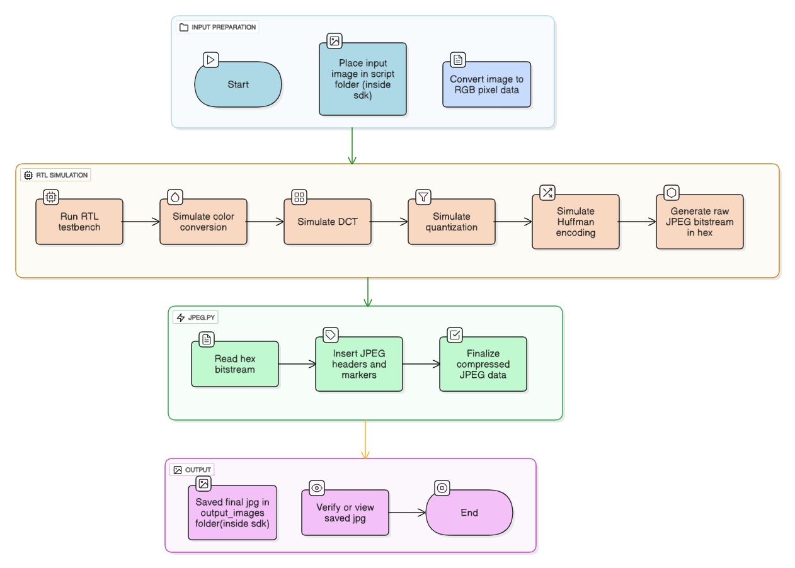
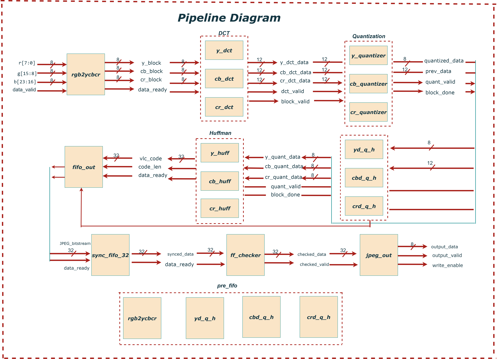
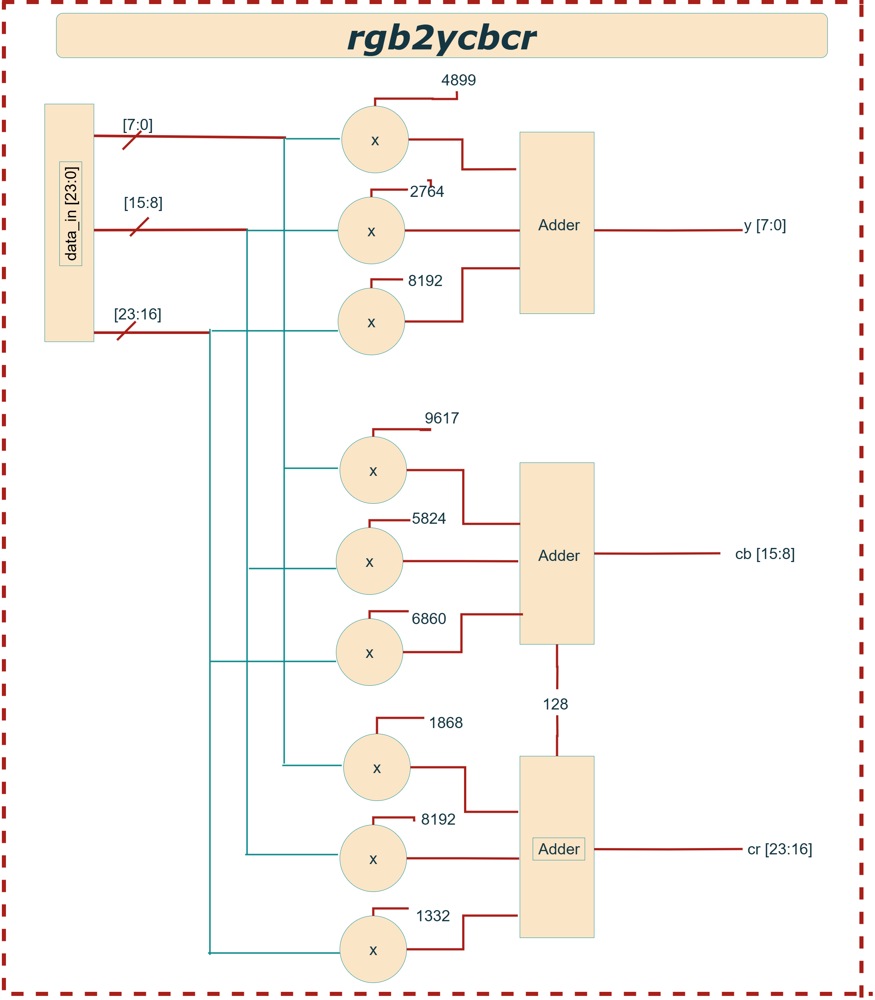
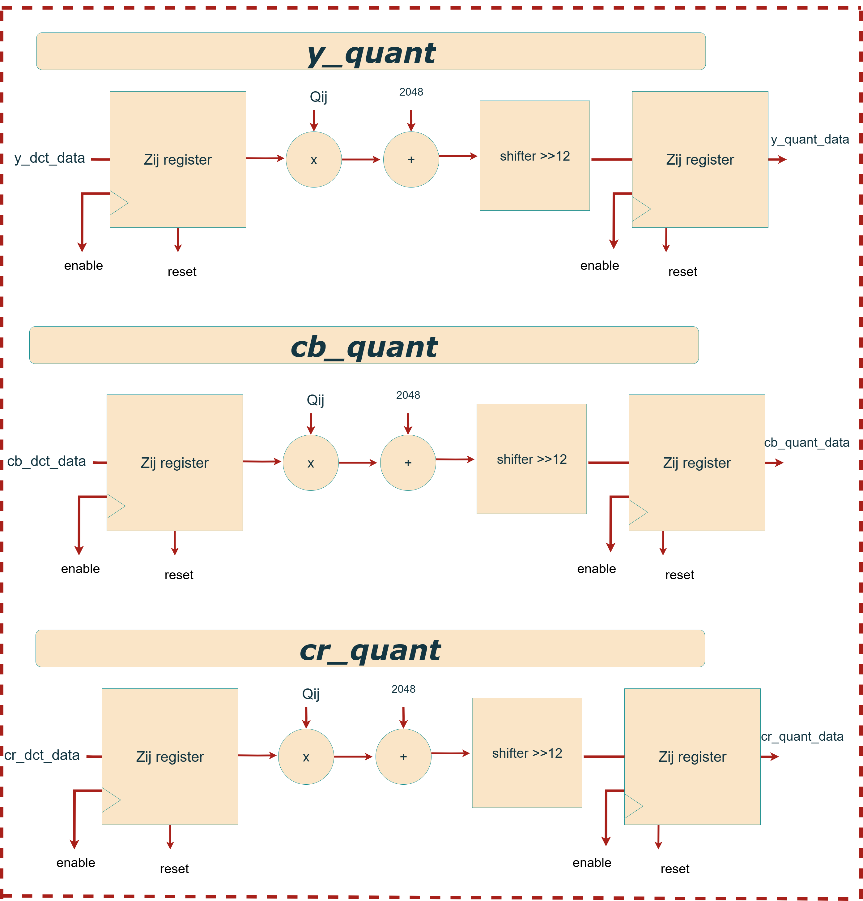
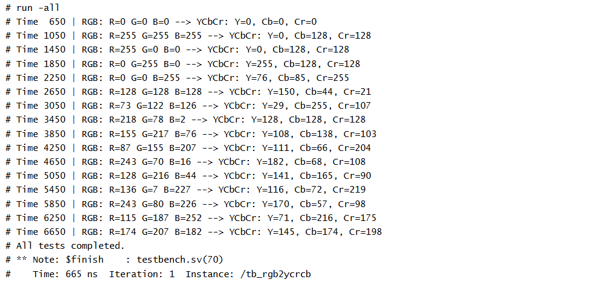
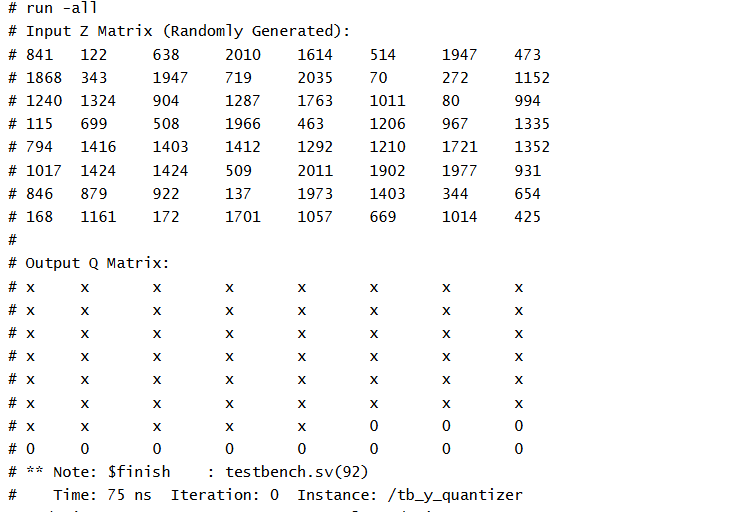

# JPEG-Based Lossy Image Compression System

> **Hardware JPEG Encoder (SystemVerilog Implementation)**  
> © 2025 [Maktab-e-Digital Systems Lahore](https://github.com/meds-uet)  
> Licensed under the Apache 2.0 License.

---

## Table of Contents
- [Overview](#overview)  
- [Why JPEG?](#why-jpeg)  
- [Repository Structure](#repository-structure)  
- [System Architecture](#system-architecture)  
- [Modules Descriptions](#modules-descriptions)  
- [FSM States](#fsm-states)  
- [Testbenches](#testbenches)  

---

## Overview

This project implements a **hardware JPEG encoder** in **SystemVerilog**.  
It compresses raw RGB image data following the JPEG pipeline:

## Workflow Flowchart

  

*Overall flow of JPEG Compression Steps*

---

## Why JPEG?

- Reduces file size by discarding perceptually insignificant data  
- Enables fast transmission and efficient memory use  
- Maintains high visual fidelity  
- Universally supported across hardware/software platforms  

---

## Repository Structure

The project is organized into **RTL design**, **Testbenches**, and **SDK utilities**.
| Folder        | Description |
|---------------|-------------|
| **rtl/**      | Core SystemVerilog modules for JPEG encoder:   • **Color Conversion**: `rgb2ycbcr`   • **DCT**: `y_dct`, `cb_dct`, `cr_dct` (+ `_constants.svh`)   • **Quantizers**: `y_quantizer`, `cr_quantizer`, `cb_quantizer` (+ `_constants.svh`)   • **Huffman**: `y_huff`, `cb_huff`, `cr_huff`   • **Bitstream Handling**: `pre_fifo`, `sync_fifo_ff`, `sync_fifo_32`, `ff_checker`, `fifo_out`   • **Combined**: `y_d_q_h`, `cb_d_q_h`, `cr_d_q_h` |
| **testbenches/** | Verification modules & input/output test data:   • `rgb2ycbcr_tb/`   • `dct_tb/`   • `quantization_tb/`   • `huffman_tb/`   • `jpeg_top_TB/` – full encoder verification |
| **sdk/**      | Scripts & tools for I/O and post-processing:   • `testimages/` – raw input images   • `output_images/` – compressed results   • `scripts/data_in.py` – converts images to 24-bit BGR pixel data (`pixel_data.txt`)   • `raw_jpeg_bitstream_to_image/jpeg.py` – merges headers + bitstreams into valid JPEG   • `Headers/` – predefined JPEG headers (`.bin`)   • `bitstream/` – sample bitstreams (`.hex`)   • `docs/` – diagrams & documentation |

---

## Image to RGB Pixels (`script/data_in.py`)
This script converts an image into **SystemVerilog testbench-ready pixel data**.  
It outputs **24-bit BGR values** in **8×8 block order** with enable and EOF signaling.  
***Output*** → `rtl/pixel_data.txt`  

---
## raw_jpeg_bitstream_to_image (`jpeg.py`)
Utility for reconstructing JPEG images from:  
- Predefined header (`.bin`)  
- Compressed bitstream (`bitstream_output.txt`)  
Performs header patching, bitstream merging, and outputs valid `.jpeg` files into `output_images/`.

---
> ## Insight about header 
> A JPEG file always begins with a **header section** that tells any JPEG decoder how to interpret the compressed image data.  
> The header contains:

> - **SOI (Start of Image marker)** – signals the beginning of the JPEG file.  
> - **APP0 / JFIF marker** – provides version and density information.  
> - **DQT (Define Quantization Tables)** – stores quantization tables used during compression.  
> - **SOF (Start of Frame)** – defines image size, color components, and precision.  
> - **DHT (Define Huffman Tables)** – stores Huffman coding tables for entropy coding.  
> - **SOS (Start of Scan)** – marks where the actual compressed image data begins.  

> After the header, the JPEG bitstream of encoded image blocks is appended.  
> Finally, the file ends with the **EOI (End of Image marker)**.  

> This project uses **predefined headers (header.bin files)** for different resolutions and settings, so the encoder only needs to output the raw compressed data. > The script then attaches the correct header, making a complete and valid JPEG file.

## System Architecture
### Top-Level Block Diagram

 

#### Inputs:
* `data_in [23:0]`: RGB input pixel `{R, G, B}`
* `enable`: Starts processing the current pixel
* `end_of_file_signal`: Flags final pixel
* `rst`: Active-high reset
* `clk`: Clock signal
  
### Detail:
The jpeg_top module is the main entry point for the JPEG encoder core and interfaces with minimal external signals. It operates using a single global clock, with all registers synchronized to its rising edge. The main control signals are `enable`, `reset`, and `end_of_file_signal`. The enable signal should be asserted high when pixel data is available and must remain high while ***feeding 64 pixels (one 8×8 block) over 64 consecutive clock cycles***. After each block, enable must stay high for at least 33 additional clock cycles (during which no new data is provided), followed by one clock cycle of enable being low before loading the next block. This pattern repeats for all blocks in the image. Pixel data is provided via a 24-bit input bus, where blue is in bits `[23:16]`, green in `[15:8]`, and red in `[7:0]`. The `end_of_file_signal` is asserted high at the first cycle of the last 8×8 block to notify the core that the current data is the final block and that all remaining bits must be output.

#### Outputs:

* `JPEG_bitstream [31:0]`: Final compressed JPEG data
* `end_of_file_bitstream_count [3:0]`: Remaining byte count
* `eof_data_partial_ready`: Final block ready signal
* `data_ready`: Valid compressed output signal
  
### Detail:
The output of the encoder is a 32-bit JPEG bitstream provided on the `JPEG_bitstream` signal. The most significant byte is in bits `[31:24]`, followed by `[23:16]`, `[15:8]`, and [7:0]. This output is valid only when the data_ready signal is high, which is asserted for one clock cycle per valid output word. For the final block, if the remaining bits do not fill an entire 32-bit word, the signal eof_data_partial_ready will go high for one cycle, and the number of valid bits in JPEG_bitstream is indicated by the 5-bit `end_of_file_bitstream_count`. This ensures that no compressed data is lost at the end of the encoding process.

---

## Pipeline Architecture

 

The JPEG encoding pipeline starts with the `rgb2ycbcr` module, which converts RGB pixels into 8×8 `Y`,`Cb`, and `Cr` blocks and asserts data_ready. These blocks are processed in parallel by `y_dct`, `cb_dct`, and `cr_dct`, producing 12-bit frequency coefficients Each output goes to its respective quantizer, generating 8-bit quantized data and control signals. From here, data follows two paths: one into the Huffman encoders, producing `vc_code` and `code_len`, and another into intermediate buffers, combined as 24-bit data_in for `pre_fifo`. Both streams meet at `fifo_out`, which assembles a 32-bit J`PEG_bitstream` with `data_ready` and `orc_reg`. This bitstream passes through `sync_fifo_32` for synchronization, then through the `ff_checker` for integrity checks, and finally exits via the `jpeg_out` module as `output_data` with `output_valid`.

---
## Modules Descriptions
### `RGB2YCBCR`

The `rgb2ycbcr module` is the first processing block in the JPEG encoder pipeline, responsible for converting incoming 24-bit RGB pixel data {B[7:0], G[7:0], R[7:0]} into the YCbCr color space {Cr, Cb, Y} using the ITU-R BT.601 standard. This transformation separates luminance (Y) from chrominance (Cb and Cr) using weighted sums of the red, green, and blue components:

  1. `Y  =  0.299 × R + 0.587 × G + 0.114 × B`
  2. `Cb = -0.1687 × R - 0.3313 × G + 0.5 × B + 128` 
  3. `Cr =  0.5 × R - 0.4187 × G - 0.0813 × B + 128`
                                                    
To implement this efficiently in hardware, all coefficients are scaled by `2¹³ (8192)` and applied using fixed-point arithmetic. The conversion is pipelined in two stages: the first computes fixed-point products and partial sums, while the second performs rounding (based on the 13th discarded bit), adds chrominance offsets, right-shifts to restore 8-bit values, clips the results to the 0–255 range, and registers the outputs. The output YCbCr data becomes valid after two clock cycles, and a pipelined enable_out signal ensures accurate timing.

---

### `*_dct`: DCT Modules

The `y_dct, cb_dct, and cr_dct modules` each perform a 2D Discrete Cosine Transform (DCT) on 8×8 blocks of image data corresponding to the Y (luminance), Cb (chroma blue), and Cr (chroma red) components in a JPEG encoder. This transformation shifts pixel data from the spatial domain to the frequency domain, enabling efficient compression. The computation follows the formula 

DCT_Output = T × Block × inv(T)

The DCT uses a scaled matrix T **(×2¹⁴ = 16384)** with three pipeline stages: row-wise multiplication, column-wise transform (Tᵀ), and final rounding. Pixel zero-centering (–128) is skipped, since rows 2–8 cancel the offset naturally. Only row 1 adds bias, corrected by subtracting ***5932032**.

---

## `*_quantizer`: Quantization Modules

 

The `y_quantizer, cr_quantizer, and cb_quantizer` modules perform lossy compression by quantizing an 8×8 block of Y (luminance) DCT coefficients. Instead of dividing by quantization constants, each coefficient is multiplied by a precomputed reciprocal scaled by 2¹² (4096). These reciprocals (e.g., QQ1_1 = 4096 / Q1_1) are fixed at compile time and stored in a matrix. The design uses a 3-stage pipeline: (1) sign-extend the 11-bit DCT input to 32 bits, (2) multiply by the scaled reciprocal, and (3) apply a right-shift with rounding (based on bit 11) to remove the 2¹² scaling and produce the quantized output.

---

### `*_huff`: Huffman Encoding

  

The `y_huff, cb_huff, and cr_huff modules` perform JPEG-compliant Huffman encoding for the `Y` (luminance), `Cb` (chroma-blue), and `Cr` (chroma-red) channels, respectively. Each module operates in five stages: ***(1)*** extracting sign and magnitude of the quantized DCT coefficients, ***(2)*** applying run-length encoding (RLE) to compress sequences of zero-valued AC coefficients, ***(3)*** performing lookups in predefined JPEG Huffman tables, ***(4)*** packing the variable-length Huffman codes and amplitudes into 32-bit words, and ***(5)*** outputting the encoded data stream. 

---

### `*d_q_h`:

### `FIFO and FSM Handling`:
The `y_d_q_h, cb_d_q_h, and cr_d_q_h modules` each combine the DCT, quantizer, and Huffman encoder into a single compact processing unit for the Y, Cb, and Cr components respectively.

---

### Block Diagram

  

The pre_fifo module acts as a wrapper that groups outputs from `y_huff`, `cb_huff`, `cr_huff`, and `rgb2ycbcr`, without adding any logic. Its output is fed into the `fifo_out` module, which connects to three 32-bit × 16-entry sync_fifo_32 buffers, temporarily storing Huffman-encoded data from the `Y`, `Cb`, and `Cr` channels. Although small quantization tables can produce longer Huffman codes and risk overflowing the Cb or Cr FIFOs (over 512 bits per block), testing showed no overflows; the Y channel is read more frequently and is less prone to this issue.

The JPEG bitstream is constructed sequentially: Huffman codes for Y, followed by Cb, then Cr for each 8×8 macroblock, repeated across the image. After `fifo_out`, the `ff_checker` module scans the byte-aligned stream and inserts `0x00` after any `0xFF` byte to comply with JPEG byte-stuffing rules, using an internal sync FIFO for temporary storage. The top-level jpeg module encapsulates both fifo_out and ff_checker, producing the final validated JPEG bitstream.

## FSM States

State machine governs the final output of the JPEG encoder by coordinating the reading and byte-stuffing of data from the Y, Cb, and Cr FIFOs. Initially, in the `IDLE` state, it waits until the Y FIFO has at least one byte available. Once ready, it transitions to the READ_Y state to fetch a byte of luminance `Y` data. After reading, the system enters the `CHECK_FF` state, where it checks if the byte is 0xFF. If so, it sets a flag (insert_zero = 1) to trigger byte-stuffing, a necessary step in JPEG encoding to avoid confusion with marker codes. In the OUTPUT state, the byte is sent to the output stream, and if the flag is set, a `0x00` byte is inserted right after. After processing the Y data, the state machine moves to `READ_CB` to handle the blue chrominance (Cb) byte and then to `READ_CR` for the red chrominance (Cr) byte, applying the same read, check, and output logic. This sequence ensures that the final JPEG bitstream is correctly serialized and compliant with the JPEG standard.

## Testbenches
## Overall Testing:

##  `jpeg_top_TB`

Testbench verifies the jpeg_top module by feeding it pixel data from an external file `data_in` and capturing the compressed JPEG bitstream. At the start, it opens output file `jpeg_output.hex` where the results will be saved. The DUT is reset and enabled, after which the pixel values are applied as 24-bit RGB inputs. During simulation, whenever the data_ready signal is asserted, the 32-bit JPEG bitstream word is written in hexadecimal format to both output files and also displayed on the console. Once all input pixels are processed and the end-of-file condition is reached, the files are closed and the simulation ends, confirming that the JPEG bitstream has been successfully generated.

## Module-Wise Testing:
##  1. `tb_rgb2ycrcb`

### 1. Purpose of Test Cases
The testbench is designed to check the accuracy of color space conversion under common edge cases and validate robustness with random RGB inputs. It ensures proper pipeline behavior, rounding, and output timing of the rgb2ycrcb module.

 ### 2. Expected Output:
Each input is applied with a 1-cycle enable signal and a 3-cycle wait to accommodate pipeline latency. The testbench checks for a valid `enable_out` and prints the YCbCr result in a readable format. 

 

 
 

---

## 2. `*_dct:`
### 1. Purpose of Test Cases
This testbench verifies the `*_dct module`, which performs an 8×8 Discrete Cosine Transform (DCT) on image blocks as part of JPEG encoding. It serially feeds 8-bit input pixels and observes 64 signed 11-bit DCT output coefficients. The test also tracks `output_enable` to confirm pipeline latency.

 ### 2. Expected Output:
Once processing is complete, `output_enable` goes high.
The testbench prints:
- The full 8×8 DCT coefficient matrix using `$write` formatting.
- A status line summarizing timing and DC verification,
  
 ### `*_dct`:
  

  

---

## 3. `tb_*_quantizer`
### 1. Purpose
The test cases are designed to confirm that the quantization logic correctly applies scaling and rounding to signed DCT coefficients. The expected outputs are computed using the same reciprocal-based method used in hardware: multiplying by (4096 / Q[i][j]), right-shifting by 12, and rounding toward zero. The goal is to validate accuracy, rounding behavior, and pipeline timing across various coefficient patterns.

### 2. Expected Outputs
After applying inputs and enabling the module for one clock cycle, the testbench waits for the `out_enable signal` to assert (indicating pipeline completion). It then prints the input matrix, expected quantized values, and actual hardware outputs side-by-side for visual comparison

 ### `*_quantizer:` 
  
  

  
  

  
  
---

## 4. `tb_*_huff`:
### 1. Purpose
The testbench validates the functionality of the `*_huff module`, which performs Huffman encoding on an 8×8 block of quantized DCT coefficients for the components in JPEG compression. It ensures correct encoding of sparse DCT blocks, including proper handling of DC and AC coefficients, `output bitstream` generation, and `end-of-block signaling`.
  
### 2. Expected Outputs
For each test case, the monitor displays:The evolving state of `data_ready`, `output_reg_count`, `end_of_block_output`, and `JPEG_bitstream`.The encoded output should reflect the DC value followed by Huffman-encoded non-zero AC coefficients, terminated with an end-of-block symbol.

 ### `*_huff`:
  
  

 
  

---
> **Disclaimer:** This project is inspired by and makes reference to the [oc_jpegencode](https://github.com/chiggs/oc_jpegencode) repository. I have studied its implementation to understand JPEG encoding and have adapted certain  where applicable.

---

---
Licensed under the **Apache License 2.0**
Copyright © 2025
**[Maktab-e-Digital Systems Lahore](https://github.com/meds-uet)**

---
