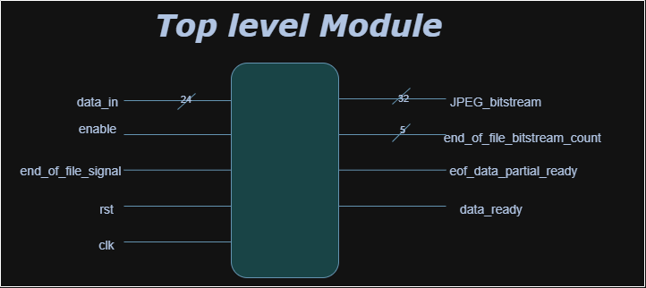

<p align="center">
  
</p>

<h1 align="center">JPEG-Based Lossy Image Compression System</h1>

<p align="center">
  <b>A hardware-implemented JPEG encoder for efficient lossy image compression using SystemVerilog.</b>
</p>


## Top-Level Block Diagram

<p align="center">
  
</p>

---

## Key Features

- Fully synthesizable **SystemVerilog implementation** of JPEG encoder modules 
- Includes **DCT**, **Quantization**, and **Huffman Encoding** blocks 
- Modular architecture for **Y, Cb, and Cr** component processing 
- Verified using **Cocotb testbenches** with Python golden models 
- Supports **pipeline optimization** and **byte-stuffing handling**

---

## Getting Started

### Clone the Repository

```bash
git clone https://github.com/YourUsername/JPEG-Encoder.git
cd JPEG-Encoder
```

### Build & Simulate

Run a simple module test (e.g., Y DCT) using Make:

```bash
make SIM=y_dct
```

## Quick Links

| Category | Description | Location |
|----------|-------------|----------|
|  **Documentation** | ReadTheDocs Project Page | [ReadTheDocs](https://jpeg-encoder.readthedocs.io/en/latest/) |
|  **Simulations** | All Cocotb testbenches | `tests/` directory |
| **Modules** | Each core block (DCT, Quantizer, Huffman, FIFO) | `src/` directory |
| **License** | Project's license file | `LICENSE` |

---

## Full Documentation

For detailed module descriptions, timing diagrams, and verification results, visit:

**[Full Documentation on ReadTheDocs](https://jpeg-encoder.readthedocs.io/en/latest/)**

---

<p align="center">
  Developed at the <b>MEDS)</b>, UET Lahore.
</p>
