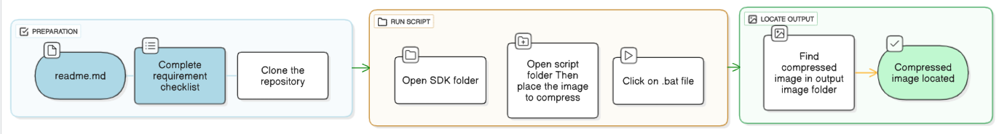

# JPEG-Based Lossy Image Compression System
*A real-time, low-power RGB → JPEG bitstream converter for embedded systems*

---

© 2025 **Maktab-e-Digital Systems Lahore**  
Licensed under the [Apache 2.0 License](https://www.google.com/search?q=LICENSE)

---

## Table of Contents
- [Overview](#overview)
- [Requirements](#requirements)
- [Getting Started](#getting-started)
  - [Step 1: Clone the Repository](#step-1-clone-the-repository)
  - [Step 2: Place Input Image](#step-2-place-input-image)
  - [Step 3: Run Simulation](#step-3-run-simulation)
  - [Step 4: Output](#step-4-output)
- [Troubleshooting](#troubleshooting)
- [Useful Links](#useful-links)
- [Contribution](#contribution)
- [Documentation](#documentation)
- [Disclaimer](#disclaimer)
- [Licensing](#licensing)

---

## Overview

The **JPEG Encoder** project converts **raw RGB images into JPEG compressed format** using a **hardware-based encoder implemented in SystemVerilog**.  
It is designed for real-time, low-power applications in embedded systems.

---
## Compression Example

*Before Compression vs After Compression*  
<p align="center">
  
</p>
---

## Requirements

- **HDL Simulator (QuestaSim)**  
  [Download from Siemens EDA](https://support.sw.siemens.com/en-US/downloads)  

  **Steps:**
  1. Sign in with your Siemens EDA/Mentor account (your university/company usually provides this).  
  2. Navigate to **Downloads → Questa Advanced Simulator**.  
  3. Select version & OS, then download.  
  4. Apply your organization’s license file.  

- **Python 3.8+**  
  [Download here](https://www.python.org/downloads/)  
  (check **“Add Python to PATH”** during installation).  

  ```bash
  python --version
  ```

- **Python Libraries**  
  Required: `Pillow` and `NumPy`  

  ```bash
  python -m ensurepip --default-pip
  pip install pillow numpy
  ```

  If using `python3`:

  ```bash
  python -m pip install pillow numpy
  ```

  Verify installation:

  ```bash
  pip show pillow
  pip show numpy
  ```

---

## Getting Started
## Workflow Flowchart

<p align="center">
  
</p>

*Overall flow of JPEG Compression Steps*

### Step 1: Clone the Repository

```bash
git clone https://github.com/rmknae/JPEG--ENCODER.git
cd JPEG--ENCODER
```

### Step 2: Place Input Image

Place your test image inside the `script/` folder.  
Supported formats: `.jpg`, `.png`, `.jpeg`.

### Step 3: Run Simulation

Run the provided batch file:

- **Windows:**  
  Double-click `run.bat`

- **Linux/Mac:**  
  Run commands manually:

  ```bash
  python data_in.py
  vlog ./src/*.sv ./testbench/*.sv
  vsim -c -do "run -all; quit" tb_top
  python script/raw_jpeg_bitstream_to_image/jpeg.py
  ```

  Or create your own `run_sim.sh` shell script to automate.

### Step 4: Output

The final JPEG image is saved inside the `output_images/` folder.

---

## Troubleshooting

| Problem | Solution |
|---------|----------|
| Python cannot find **Pillow** or **NumPy** | Run `pip install pillow numpy`. |
| **`vsim` not found** | Add the QuestaSim `win64` folder to your `PATH`. |
| Paths with spaces fail | Wrap in quotes: `"C:\Users\HH Traders\Documents\JPEG--ENCODER"`. |
| CMD closes immediately | Run `run.bat` from an already open Command Prompt window. |

 **Note:** Always use **native Windows paths**. Avoid `\\wsl.localhost\...` or WSL paths as they may cause compatibility issues.

---

## Useful Links

- [JPEG Standard Overview](https://en.wikipedia.org/wiki/JPEG)  
- [SystemVerilog Basics](https://www.chipverify.com/systemverilog/systemverilog-introduction)  
- [Python Pillow (PIL)](https://pillow.readthedocs.io/en/stable/)  

---

## Contribution

We welcome contributions 

- Report issues in the [Issues tab](https://github.com/rmknae/JPEG--ENCODER/issues)  
- Submit pull requests with improvements or bug fixes  

---

## Documentation

[Read the Documentation](https://meds-jpeg-docs.readthedocs.io/en/latest/?badge=latest)

---

## Disclaimer

This project is inspired by the  
[oc_jpegencode](https://github.com/chiggs/oc_jpegencode) repository.  
We studied its implementation and adapted certain parts where applicable.

---

## Licensing

Licensed under the **Apache License 2.0**  
Copyright © 2025  
**[Maktab-e-Digital Systems Lahore](https://github.com/meds-uet)**
